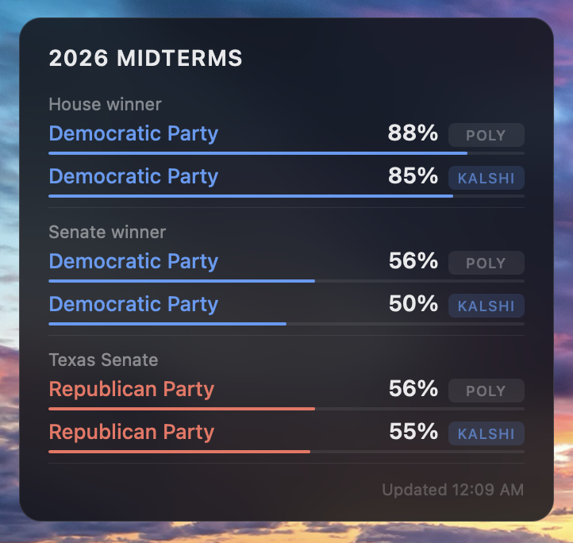

# 2026 Midterms Widget for Übersicht

A macOS desktop widget that tracks live 2026 US midterm election odds from two prediction markets side by side.

## What it tracks

- **House winner** — which party wins the House
- **Senate winner** — which party wins the Senate
- **Texas Senate**
- **Ohio Senate**
- **Alaska Senate**
- **North Carolina Senate**

Each race shows odds from both **Polymarket** and **Kalshi**, so you can spot when the two markets diverge.

## Requirements

- macOS
- [Übersicht](http://tracesof.net/uebersicht/) — free desktop widget app

## Installation

1. Install [Übersicht](http://tracesof.net/uebersicht/)
2. Download or clone this repo
3. Move the `polymarket-midterms.widget` folder into your Übersicht widgets directory (Übersicht menu bar icon → Open Widgets Folder)
4. The widget appears on your desktop automatically

## Data sources

- [Polymarket](https://polymarket.com/predictions/midterms) via the public Gamma API (no auth required)
- [Kalshi](https://kalshi.com/category/elections/us-elections) via the public Elections API (no auth required)

Refreshes every 5 minutes.

## Customization

Open `polymarket-midterms.widget/index.coffee` in any text editor.

- **Position**: change `left` and `top` in the `style` block at the bottom
- **Width**: change `width` in the `style` block
- **Refresh rate**: change `refreshFrequency` at the top (value is in milliseconds — 300000 = 5 minutes)
- **Races**: swap out the slugs in `polySlugs` and tickers in `kalshiMarkets` to track different races

## Built with

- [Übersicht](http://tracesof.net/uebersicht/)
- [Polymarket Gamma API](https://docs.polymarket.com)
- [Kalshi Elections API](https://docs.kalshi.com)
